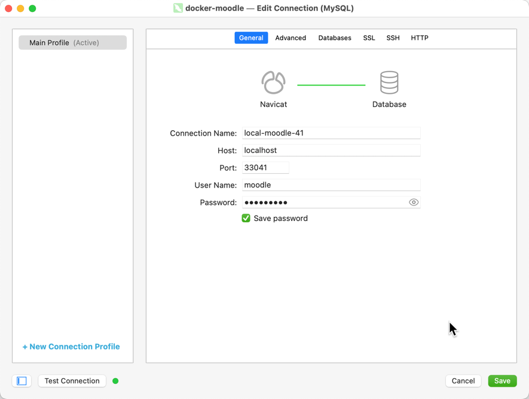

# Moodle Docker Brew

Simplify your Moodle plugin development with this Homebrew script for managing Moodle Docker environments.

## Features

- Build for MacOS and OrbStack (high-speed Docker client)
- Homebrew installation support
- Concurrently run multiple Moodle versions
- Support for `behat` and `phpunit` testing frameworks
- Pre-execution checks for error prevention
- Local Moodle files storage (`~/moodle-docker-brew/moodle`)
- Moodle version support: 44, 43, 42, 41, 40, 311, 310, 39
- Unique port assignments for different Moodle test suites
- Local access via `http://localhost:{port}/` where `{port}` corresponds to the Moodle version (e.g., 8042 for Moodle 42)
- Default account "admin" password is "test"
## Installation

### Prerequisites

Ensure Homebrew is installed. If not, you can install it using:

```bash
/bin/bash -c "$(curl -fsSL https://raw.githubusercontent.com/Homebrew/install/HEAD/install.sh)"
```

### Docker Client: OrbStack

For a faster Docker experience, we recommend OrbStack:

```bash
brew install orbstack
```

### Moodle Docker Installation

```bash
brew install ldesignmedia/moodledocker/moodle-docker
```
More info about this packages can be found here: https://github.com/LdesignMedia/homebrew-moodle-docker


> **Note:** The script automatically creates a directory at `~/moodle-docker-brew` to store Moodle files and data. Using `moodle-docker destroy` will remove all data for a specific Moodle version.

## Commands

```bash
moodle-docker help  # Display help

# Start Moodle instances
moodle-docker start {version}  # e.g., moodle-docker start 42

# Stop Moodle instances
moodle-docker stop {version}  # e.g., moodle-docker stop 42

# Remove Moodle instances and data
moodle-docker destroy {version}  # e.g., moodle-docker destroy 42

# Update PHPUnit and Behat tests needed if you add new plugins
moodle-docker update {version}  # e.g., moodle-docker update 42
```

## Upgrade

To update to the latest version:

```bash
brew upgrade moodle-docker
moodle-docker upgrade  # Install the latest moodle-docker version
```

## PHP Version Constraints

Moodle 3.9 is compatible only with PHP 7.4. All other versions use PHP 8.0. The PHP version is currently not configurable.

## Behat and PHPUnit Examples

```bash
# Behat
moodle-docker behat {version} --tags=@tag  # e.g., moodle-docker behat 42 --tags=@auth_manual

# PHPUnit
moodle-docker phpunit {version} path/to/test  # e.g., moodle-docker phpunit 42 auth/manual/tests/manual_test.php
```

## Behat VNC Support

To connect to a Behat VNC session:

- Download a VNC client like [RealVNC](https://www.realvnc.com/en/connect/download/viewer/)
- Host: `localhost` or `0.0.0.0`
- Port: `59000 + Moodle version number` (e.g., 59042 for Moodle 42)
- Password: `secret`

## Database connection with e.g. Navicat

- Host: `localhost` or `0.0.0.0`
- Username: `moodle`
- Port: `33000 + Moodle version number` (e.g., 33042 for Moodle 42)
- Password: `m@0dl3ing`



## Contributing

Contributions are welcome and will be fully credited. We accept contributions via Pull Requests on Github.


## To-Do List

- [ ] Add developer/commander tools
- [ ] How to video how to configure PHPStorm for plugin testing
- [ ] Add Xdebug settings
- [ ] Command to stop all running instances
- [ ] Display all running Moodle versions
- [ ] Option to install specific PHP versions
- [ ] Run the container for behat testing interactive, so we can pause a behat test

## Authors

* Luuk Verhoeven :: [Ldesign Media](https://ldesignmedia.nl/) - [luuk@ldesignmedia.nl](luuk@ldesignmedia.nl)


